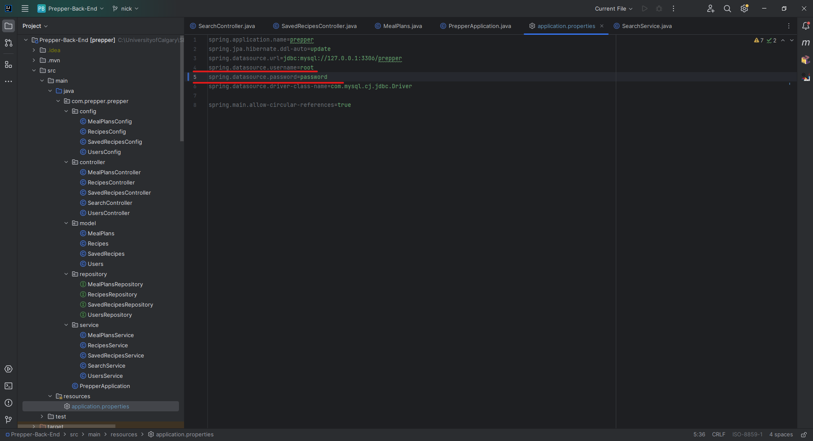

# Prepper

For people learning how to live independently, cooking and nutrition is often an afterthought. Planning each and every meal, as well as ensuring that you have every ingredient you need can be stressful without a proper tool to help you. Additionally, recipes and meal inspiration usually come through the form of social media. By incorporating a daily planner, as well as an instagram-like format, users can plan out their meals and scroll through the meals of others. You can view the photos of the meal, their ingredients and the time it takes to recreate the recipe. When you finish deciding what your meals are, you can select them and upload them to your calendar or add a completely new meal that will be saved in your personal recipe book. 


## Authors

- Braden Vivas
- Julia Lat
- Cole Thompson
- Jordan Torske
- Jordan Vanbeselaere
- Sarah Qin
- Nicholas Garcia


## How To Run This Project

To run this project, you will need three platforms:

**1. Vscode**
- Download Link: https://code.visualstudio.com/download
**2. IntelliJ Community Edition**
- Download Link: https://www.jetbrains.com/idea/download
**3. MySQL**
- Download Link: https://dev.mysql.com/downloads/mysql/

***Steps To Run This Project***

**1. Clone the Back-End and Front-End Repositories**
- Repo Links:
    - https://github.com/adriannejulie/Prepper-Food-Planner (Front-End)
    - https://github.com/adriannejulie/Prepper-Back-End (Back-End)

**2. Initialize the MySQL database**
- Click on an existing/or create a new MySQL connection.

- After logging in to your connection, create a new query file and type these enter these commands
    - ```drop database if exists prepper;```
    - ```create database prepper;```
    - ```use prepper;```


- Run these commands


**3. Run The Backend**
- In IntelliJ, open the cloned backend repo, navigate to the PrepperApplication file and click run

- ***Important*** - in the applications.properties file, make sure that your username and password match the username and password for your MySQL


**4. Run The Frontend**
- In Vscode, open the cloned frontend repo. Change the working directory to REACT-APP
    - Run the command ``` npm install ```
    - After the completion of the ``` npm install command```, run the command ``` npm start```

After doing these 4 things, you should be able to properly run the prepper application. 


